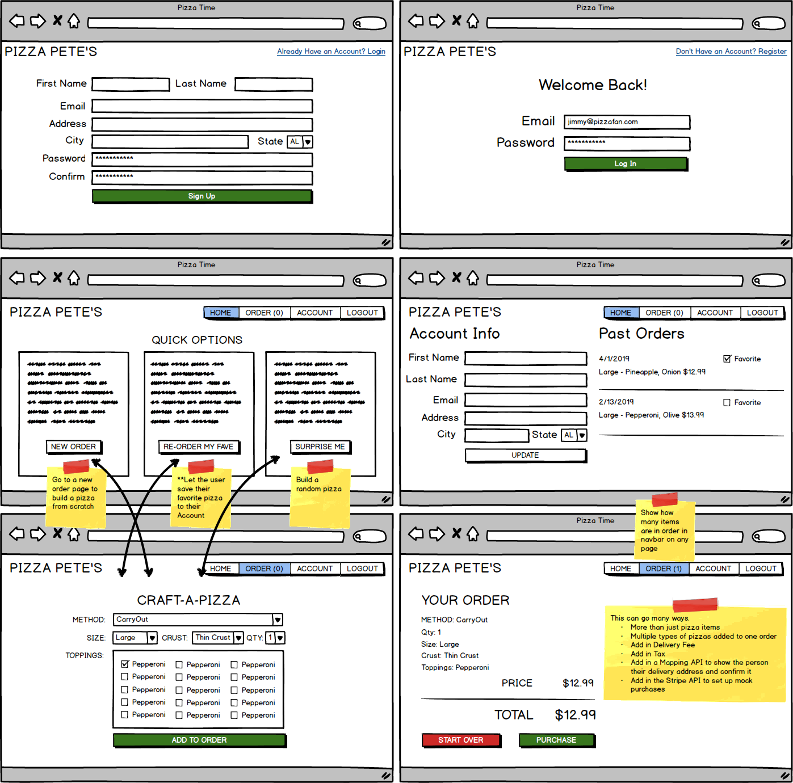

# Just Waffles Project
> Autora:  Zulema Medina

## Descripción
Aplicación web para realizar pedidos de Waffles, con opciones de creación de pedido de waffle manual, aleatorio y re ordenar un pedido anterior marcado como favorito, cuenta con registro e inicio de sesión de los usuarios, asi como la actualización del perfil de los mismos.

## Objetivos
- Registro e inicio de sesión
- Actualización de perfil de usuario
- Crear pedido manual (Elegir manualmente las opciones)
- Crear pedido de un favorito (Pedido marcado anteriormente como favorito)
- Crear pedido random (Se elige de manera aleatoria el tipo de waffle)

**Opcional:** 
- Que el usuario cuente con la opcion de agregar mas direcciones y elegir una de estas antes de realizar el pedido
- Contar con otros productos de cafetería
- Manejar precios diferentes por tipo de waffle (Tipo de masa, tamaño, cantidad de toppings).

## Wireframe de referencia

